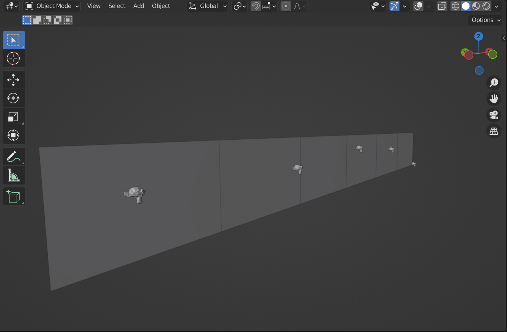
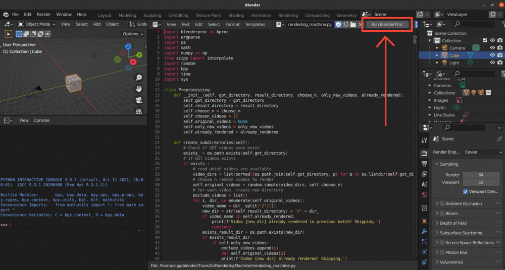

# Basic scene generation



In this example we demonstrate the basic scene generation in Blender UI.

## Usage

Execute in the `RenderingMachine` directory. 

```bash
conda activate blender

blenderproc debug rendeding_machine.py 1
```

It will open the Blender UI. To start the BlenderProc pipeline, one now just has to press `Run BlenderProc` (see red rectangle in image).



Next, click on `Layout` button to see the scene. Now, let's render our first image on the scene. On keyboard, press `Numpad + 0` (or click on ) to toggle to the camera view. With arrow keys, change position of the camera. To render one image, press `F12` or `Ctrl + F12` to render whole sequence.

Note that annotations will not be generated in the debug mode.


